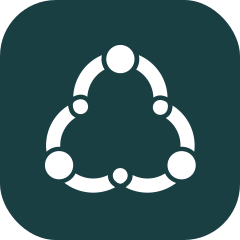

<p align="center">
  <br>
  <a href="https://openmarketplace.org/">
     
  </a>
</p>


<h1 align="center"><a href="https://openmarketplace.org"> Open Marketplace Apps</a></h1>

<p align="center">Open marketplace apps are decentralized open source apps for smart cities and local communities.</p>

<p align="center">
  <a href="https://discord.gg/XDQQcJC" style="text-decoration:none;"></a>
  <a href="https://github.com/open-marketplace-applications/anna/blob/master/LICENSE_APACHE" style="text-decoration:none;"></a>
  <a href="https://github.com/open-marketplace-applications/anna/blob/master/LICENSE_MIT" style="text-decoration:none;"></a>
</p>

<p align="center">
  <a href="#introduction">Introduction</a> ◈
  <a href="#warning">Warning</a> ◈
  <a href="#usage">Usage</a> ◈
  <a href="#planned-milestones">Planned Milestones</a> ◈  
  <a href="#roadmap">Roadmap</a> ◈
  <a href="#joining-the-discussion">Joining the discussion</a>
</p>

---

# ANNA 

> A Next Network Application

## Introduction
This is an implementation of a decentralized eCommerce Platform written in Rust.

## Warning
This application is currently under development and is not yet ready to be used. It is currently feature incomplete and cannot be considered alpha.

## Usage

### 🛠️ Build

When building for the first time, ensure to install dependencies first.

```
yarn install
```

```
yarn run build
```

### 🔬 Serve locally

```
yarn run start:dev
```


### 🔋 Batteries Included

* [`wasm-bindgen`](https://github.com/rustwasm/wasm-bindgen) for communicating
  between WebAssembly and JavaScript.
* [`wee_alloc`](https://github.com/rustwasm/wee_alloc), an allocator optimized
  for small code size.

## Joining the discussion
If you want to get involved in discussions about this application, or you're looking for support, go to the #anna channel on [our Discord](https://discord.gg/XDQQcJC).


https://github.com/joselo/rust-crud
https://github.com/hgzimmerman/yew_patterns
https://github.com/hgzimmerman/FullstackRustDemo
https://github.com/dunnock/wasi-worker
https://github.com/jgpaiva/minesweeper